# System rekomendacji muzyki oparty na emocjach - raport badawczy

Kompletne badanie eksperymentalne systemu rekomendacji muzyki świadomego emocji. System
wykrywa stan emocjonalny osoby na podstawie zdjęcia twarzy z wykorzystaniem widzenia
komputerowego i uczenia głębokiego, a następnie poleca muzykę, której cechy dźwiękowe
pasują do tej emocji.

Raport dokumentuje każdy etap pracy: dane, przetwarzanie wstępne, każdy zbudowany i
przetestowany model, osiągnięte przez niego wyniki, ich znaczenie oraz uczciwą dyskusję
ograniczeń i możliwych usprawnień.

---

## Spis treści

1. [Streszczenie](#1-streszczenie)
2. [Wprowadzenie i cele](#2-wprowadzenie-i-cele)
3. [Przegląd systemu](#3-przegląd-systemu)
4. [Zbiory danych](#4-zbiory-danych)
5. [Eksploracyjna analiza danych](#5-eksploracyjna-analiza-danych)
6. [Potok przetwarzania wstępnego](#6-potok-przetwarzania-wstępnego)
7. [Metodologia eksperymentów](#7-metodologia-eksperymentów)
8. [Modele i wyniki](#8-modele-i-wyniki)
   - 8.1 [Klasyfikatory bazowe (kNN, drzewo decyzyjne, naiwny Bayes)](#81-klasyfikatory-bazowe)
   - 8.2 [Perceptrony wielowarstwowe (MLP)](#82-perceptrony-wielowarstwowe-mlp)
   - 8.3 [Własna konwolucyjna sieć neuronowa (CNN)](#83-własna-konwolucyjna-sieć-neuronowa-cnn)
   - 8.4 [Uczenie transferowe - MobileNetV2](#84-uczenie-transferowe--mobilenetv2-eksperyment)
   - 8.5 [Vision Transformer (ViT)](#85-vision-transformer-vit)
   - 8.6 [Warunkowy DCGAN (bonus generatywny)](#86-warunkowy-dcgan-bonus-generatywny)
9. [Zbiorcze porównanie wyników](#9-zbiorcze-porównanie-wyników)
10. [Finalny model produkcyjny](#10-finalny-model-produkcyjny--mobilenetv2-na-fer-2013)
    - 10.1 [Analiza agregacji emocji (2 klasy)](#101-analiza-agregacji-emocji-2-klasy)
    - 10.2 [Trenowanie bezpośrednio na etykietach 2-klasowych (walencja)](#102-trenowanie-bezpośrednio-na-etykietach-2-klasowych-walencja)
11. [Odkrywanie reguł asocjacyjnych (Apriori)](#11-odkrywanie-reguł-asocjacyjnych-apriori)
12. [Aplikacja](#12-aplikacja)
13. [Ograniczenia i dyskusja krytyczna](#13-ograniczenia-i-dyskusja-krytyczna)
14. [Wnioski](#14-wnioski)
15. [Dalsze prace](#15-dalsze-prace)
16. [Bibliografia](#16-bibliografia)
17. [Dodatek - jak odtworzyć wyniki](#17-dodatek--jak-odtworzyć-wyniki)

---

## 1. Streszczenie

Praca przedstawia kompletny system **rekomendacji muzyki świadomej emocji**. Zdjęcie
twarzy jest przetwarzane przez detektor twarzy **MTCNN**, kadrowane, a następnie
klasyfikowane jako jedna z siedmiu emocji (*złość, wstręt, strach, radość, neutralność,
smutek, zaskoczenie*) przez model uczenia głębokiego. Przewidziana emocja jest następnie
mapowana na atrybuty dźwiękowe muzyki (tempo, tonacja, energia) za pomocą **reguł
asocjacyjnych** odkrytych algorytmem **Apriori**, a te atrybuty sterują wyszukiwaniem
muzyki na żywo przez **Spotify API**. Cały proces został zamknięty w interaktywnej
aplikacji webowej **Streamlit**.

Część badawcza systematycznie porównuje **dziesięć konfiguracji modeli**: trzy klasyczne
klasyfikatory bazowe oceniane 5-krotną walidacją krzyżową (k-najbliższych sąsiadów,
drzewo decyzyjne, gaussowski naiwny Bayes), trzy perceptrony wielowarstwowe, własną
konwolucyjną sieć neuronową, model uczenia transferowego MobileNetV2 oraz własny Vision
Transformer. Dodatkowo zaimplementowano warunkowy DCGAN, aby zbadać generatywną syntezę
twarzy warunkowanych emocją. Eksperymenty przeprowadzono na dwóch zbiorach danych -
benchmarku **FER-2013** (35 887 obrazów) oraz małym, **idealnie zrównoważonym** własnym
zbiorze 35 samodzielnie zebranych zdjęć. Każdy wynik raportowany jest wraz z dokładnością,
makro-uśrednioną precyzją, makro-uśrednioną czułością, macierzami pomyłek dla poszczególnych
klas i krzywymi uczenia, a następnie interpretowany w kontekście. Predykcje siedmioklasowe
modelu produkcyjnego są dodatkowo **agregowane do schematów dwuklasowych** - **walencja**
(ładunek emocjonalny: pozytywny vs negatywny), **pobudzenie** (intensywność/energia emocji:
wysokie vs niskie) oraz jeden-kontra-reszta - a osobny **binarny model walencji** jest
trenowany od początku do końca (§10.1-10.2).

---

## 2. Wprowadzenie i cele

Muzyka ma silny, dobrze udokumentowany związek z ludzkimi emocjami. Idea stojąca za tym
projektem jest prosta i intuicyjna: **jeśli komputer potrafi odczytać emocję z twarzy
osoby, może polecić muzykę pasującą do jej aktualnego nastroju.** Smutna twarz może
otrzymać wolne, w tonacji molowej, niskoenergetyczne utwory; radosna - szybkie, w tonacji
durowej, wysokoenergetyczne.

Przekształcenie tej idei w działający system dotyka niemal każdego głównego obszaru
inteligencji obliczeniowej, co było właśnie powodem jego wyboru. Konkretne cele były
następujące:

1. **Zbudować realny potok klasyfikacji obrazów** - od surowych zdjęć do wytrenowanego
   modelu zwracającego emocję.
2. **Porównać szeroki wachlarz klasyfikatorów** - od najprostszych algorytmów klasycznych
   po nowoczesne architektury głębokie - i *zrozumieć, dlaczego jedne działają, a inne
   zawodzą* w tym problemie.
3. **Wyjść poza standardowy program zajęć** - implementując Vision Transformer i
   generatywną sieć przeciwstawną (GAN) oraz osadzając pracę w literaturze naukowej.
4. **Dostarczyć użyteczną aplikację** - nie tylko notatniki, lecz interaktywne narzędzie,
   które przyjmuje zdjęcie i zwraca realne, klikalne rekomendacje muzyczne.

Projekt należy do kategorii **klasyfikacji obrazów**, a raport opracowuje temat w następujących etapach: *baza danych → przetwarzanie wstępne → eksperymenty klasyfikacyjne → reguły asocjacyjne → interpretacja*.

---

## 3. Przegląd systemu

System to potok niezależnych, wielokrotnego użytku etapów.

```
 ┌────────────────┐   ┌────────────────┐   ┌────────────────┐   ┌──────────────────┐
 │ Zdjęcie twarzy │ → │   Wykrywanie   │ → │ Zmiana rozmiar.│ → │   Model emocji   │
 │  (plik/kamera) │   │  twarzy MTCNN  │   │ 48×48 + norm.  │   │   (MobileNetV2)  │
 └────────────────┘   └────────────────┘   └────────────────┘   └────────┬─────────┘
                                                                          │ dominująca emocja
                                                                          ▼
                         ┌─────────────────────┐        ┌─────────────────────┐
                         │ Spotify API – wysz.  │  ◄──── │ Reguły asocjacyjne  │
                         │ (polecane utwory)    │        │ Apriori (emocja →   │
                         └─────────────────────┘        │ tempo/tonacja/      │
                                                         │ energia)            │
                                                         └─────────────────────┘
```

---

## 4. Zbiory danych

### 4.1 FER-2013 (główny benchmark)

FER-2013 to klasyczny benchmark rozpoznawania emocji z twarzy wprowadzony przez Goodfellowa
i in. (2013). Zawiera obrazy twarzy w **skali szarości o rozdzielczości 48×48 pikseli**,
każdy oznaczony jedną z siedmiu emocji. To zbiór użyty do wytrenowania **finalnego modelu
produkcyjnego**.

| Podział  | Obrazy | Udział |
|----------|-------:|------:|
| Treningowy | 28 709 | 80 % |
| Testowy    |  7 178 | 20 % |
| **Razem**  | **35 887** | **100 %** |

Podział (≈ 80 / 20) to standardowa partycja treningowo-testowa FER-2013 dostarczana wraz
ze zbiorem.

**Rozkład klas (zbiór treningowy, 28 709 obrazów treningowych)** - z [`results/class_distribution_stats.csv`](results/class_distribution_stats.csv):

| Emocja   | Liczba | Procent |
|----------|------:|-----------:|
| radość       | 7 215 | 25,13 % |
| neutralność  | 4 965 | 17,29 % |
| smutek       | 4 830 | 16,82 % |
| strach       | 4 097 | 14,27 % |
| złość        | 3 995 | 13,92 % |
| zaskoczenie  | 3 171 | 11,05 % |
| wstręt       |   436 |  1,52 % |

Zbiór jest **silnie niezrównoważony**: klasa `radość` zawiera znacznie więcej obrazów niż
klasa `wstręt`. To realny problem - model może osiągnąć wysoką dokładność, po prostu
ignorując rzadkie klasy. Zostało to rozwiązane w finalnym modelu za pomocą
**zbalansowanych wag klas** (zob. §10).

### 4.2 Własny zbiór danych

Mały, **idealnie zrównoważony** zbiór **35 prawdziwych zdjęć twarzy** został zebrany i
opisany specjalnie na potrzeby tego projektu - **5 zdjęć na emocję × 7 emocji**. Budowa
własnego zbioru pokazuje cały potok przetwarzania (surowe zdjęcie → detekcja → kadrowanie →
tablice) na danych, które nie były wcześniej wyczyszczone ani przygotowane.

| Właściwość | Wartość |
|----------|-------|
| Surowe obrazy | 35 (5 na klasę) |
| Po kadrowaniu twarzy MTCNN | 35 |
| Po augmentacji (×3 + oryginał) | 140 |
| Balans klas | idealnie równomierny (po 14,29 %) |

Ten zbiór jest używany do **wszystkich eksperymentów porównawczych modeli** (§8). Jego mały
rozmiar to świadomy kompromis dydaktyczny, a jego konsekwencje omówiono otwarcie w §13.

---

## 5. Eksploracyjna analiza danych

Skrypt: [`src/eda.py`](src/eda.py)

Przed jakimkolwiek modelowaniem oba zbiory zostały zbadane wizualnie i statystycznie. EDA
odpowiada na dwa pytania: *czy klasy są zrównoważone?* oraz *jak właściwie wyglądają
obrazy?*

**Rozkład klas FER-2013**:

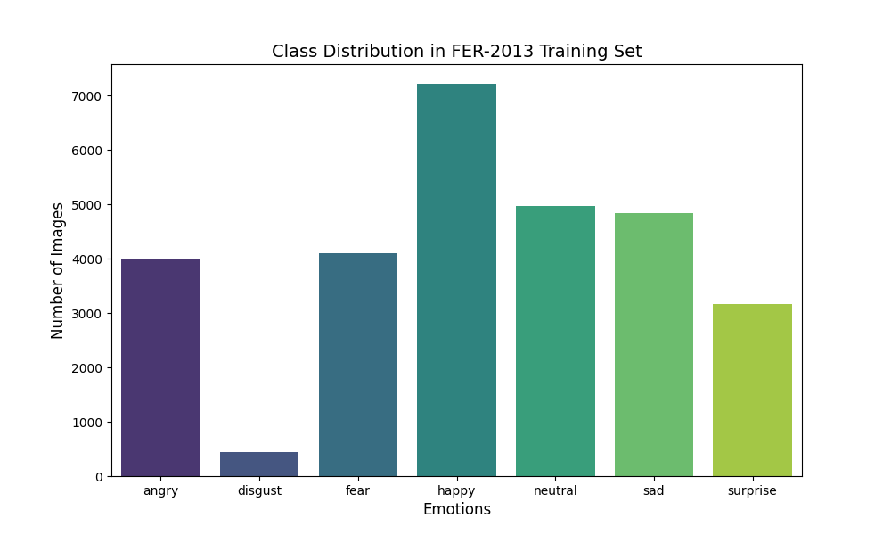

**Rozkład klas własnego zbioru**:

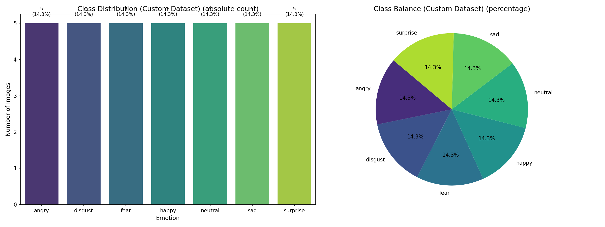

**Porównanie obok siebie** (znormalizowane do procentów, aby dwa zbiory o różnych
rozmiarach można było porównać):

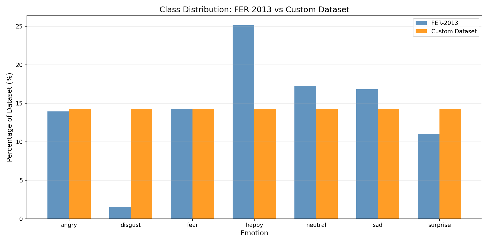

**Przykładowe obrazy w każdej klasie** potwierdzają, że dane zostały poprawnie wczytane i
oznaczone:

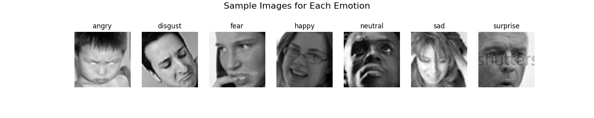

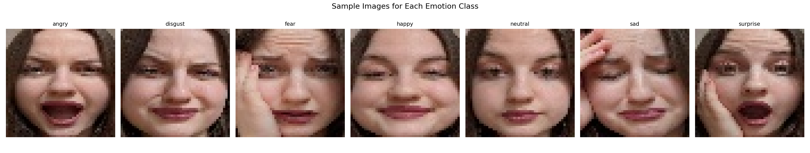

**Wniosek z EDA:** niezrównoważenie FER-2013 trzeba obsłużyć podczas treningu; własny zbiór
jest zrównoważony, ale bardzo mały, więc jego wyniki będą obarczone dużą wariancją.

---

## 6. Przetwarzania wstępne - Preprocessing

Ten etap jest decydujący dla klasyfikacji obrazów. Trzy kroki przekształcają surowe zdjęcia w czyste tablice gotowe dla modelu.

### Krok 1 - Wykrywanie twarzy / detekcja obiektów ([`face_detector.py`](src/face_detector.py))

Surowe zdjęcia zawierają tło, włosy, ubrania - szum, który nie ma nic wspólnego z emocją.
Detektor **MTCNN** (Multi-task Cascaded Convolutional Network) znajduje ramkę ograniczającą
twarz (oraz punkty charakterystyczne twarzy) na każdym zdjęciu. Zachowywany jest tylko
**kadr twarzy**; cała reszta jest odrzucana. To prawdziwy krok **detekcji obiektów** i jest
to ten sam detektor używany na żywo w aplikacji, więc trening i wnioskowanie widzą podobnie
wykadrowane twarze.

### Krok 2 - Czyszczenie i normalizacja ([`preprocess.py`](src/preprocess.py))

Każdy wykadrowany obraz twarzy jest:
1. Wczytywany w **skali szarości** (1 kanał) - kolor niesie mało informacji o emocji, a
   skala szarości pasuje do FER-2013.
2. **Skalowany** do **48×48** pikseli - stały rozmiar wejścia, który każdy model potrafi
   przyjąć.
3. **Normalizowany** do zakresu `[0, 1]` (wartość piksela / 255) - dzięki temu trening sieci
   neuronowej jest stabilny numerycznie.

Tablice zapisywane są jako pliki `.npy` dla szybkiego ponownego wczytywania.

### Krok 3 - Augmentacja danych ([`augment.py`](src/augment.py))

35 obrazów to zdecydowanie za mało, by trenować sieci głębokie. Augmentacja **syntetyzuje
nowe, realistyczne warianty** każdego obrazu, rozszerzając zbiór z **35 → 140** (każdy obraz
daje oryginał plus 3 augmentowane kopie). Transformacje symulują rzeczywistą zmienność tego,
jak twarz wygląda dla kamery:

| Transformacja | Ustawienie | Dlaczego |
|----------------|---------|-----|
| Obrót | ±15° losowo | przechylenie głowy |
| Zoom | ±15 % losowo | odległość od kamery |
| Odbicie poziome | 50 % | symetria lewo/prawo twarzy |
| Szum gaussowski | σ = 0,03 (własna funkcja) | szum matrycy / odporność |
| Tryb wypełniania | najbliższy sąsiad | wypełnia piksele odsłonięte przez obrót |

Krok z szumem gaussowskim to **własna funkcja przetwarzania wstępnego** dodana na bazie
standardowego `ImageDataGenerator` z Keras, demonstrująca kontrolę nad potokiem augmentacji
zamiast polegania na ustawieniach domyślnych.

---

## 7. Metodologia eksperymentów

Aby porównanie modeli było rzetelne i sensowne, w całej pracy zastosowano ten sam protokół.

- **Dane:** augmentowany własny zbiór (140 próbek) używany jest do wszystkich eksperymentów
  porównawczych (§8). Finalny model produkcyjny (§10) trenowany jest osobno na FER-2013.
- **Podział treningowo-testowy:** 80 % trening / 20 % test. Klasyczne klasyfikatory bazowe i
  MLP używają podziałów **stratyfikowanych** (zachowujących proporcje klas); modele głębokie
  używają stałego podziału `random_state=42`.
- **Walidacja krzyżowa:** klasyczne klasyfikatory bazowe dodatkowo używają **5-krotnej
  stratyfikowanej walidacji krzyżowej** - zbiór dzielony jest na 5 części, każda użyta raz
  jako fold testowy, a wyniki są uśredniane. Daje to bardziej wiarygodne oszacowanie niż
  pojedynczy podział na małym zbiorze.

### Jak czytać metryki

To liczby używane w całym raporcie:

- **Dokładność (accuracy)** - odsetek wszystkich predykcji, które były poprawne. Prosta, ale
  myląca na danych niezrównoważonych.
- **Precyzja** (na klasę) - spośród obrazów, które model *oznaczył* jako klasa X, ile naprawdę
  było X. Wysoka precyzja = mało fałszywych alarmów.
- **Czułość (recall)** (na klasę) - spośród obrazów, które *naprawdę* były klasą X, ile model
  znalazł. Wysoka czułość = mało pominięć.
- **Makro-precyzja** - makro-średnia precyzji na klasę (równa waga dla każdej klasy). Wysoka
  makro-precyzja oznacza mało fałszywych alarmów we wszystkich klasach.
- **Makro-czułość** - makro-średnia czułości na klasę (równa waga dla każdej klasy). Wysoka
  makro-czułość oznacza, że model pomija niewiele prawdziwych przypadków, nawet w rzadkich
  klasach.
- **Macierz pomyłek** - tabela, w której komórka (wiersz *i*, kolumna *j*) zlicza, ile
  prawdziwych obrazów klasy *i* zostało przewidzianych jako klasa *j*. Przekątna to poprawne
  predykcje; wszystko poza przekątną to konkretny typ błędu.
- **Krzywe uczenia** - dokładność/strata wykreślone na epokę treningu, zarówno dla zbioru
  treningowego, jak i walidacyjnego. Ujawniają **przeuczenie** (trening wciąż się poprawia,
  a walidacja pogarsza) oraz **niedouczenie** (oba pozostają niskie).

Dla problemu 7-klasowego **losowe zgadywanie daje ≈ 14,3 %** (1 ÷ 7 = 0,143, czyli przy
siedmiu jednakowo prawdopodobnych klasach ślepe zgadnięcie trafia raz na siedem) - to próg,
który każdy model musi przebić.

---

## 8. Modele i wyniki

> Wszystkie eksperymenty w tym rozdziale działają na **augmentowanym własnym zbiorze 140
> próbek** z 20 % zbiorem testowym (28 obrazów). Każda metryka jest automatycznie dopisywana
> do [`results/model_metrics.csv`](results/model_metrics.csv) przez narzędzie
> [`save_metrics`](src/save_metrics.py).

### 8.1 Klasyfikatory bazowe

Skrypt: [`src/baseline_models.py`](src/baseline_models.py)

**Co i dlaczego.** Zanim sięgniemy po uczenie głębokie, trzy klasyczne algorytmy ustanawiają
*poziom bazowy*. Każdy obraz 48×48 jest **spłaszczany** do pojedynczego wektora o wymiarze
2304 (piksele w jednym rzędzie), czego te algorytmy oczekują. Ich celem jest pokazanie,
*jak daleko docierają proste metody*, i uzasadnienie potrzeby modeli konwolucyjnych.

- **k-najbliższych sąsiadów (k=3)** - aby sklasyfikować nowy obraz, algorytm porównuje go
  bezpośrednio (piksel po pikselu) z wszystkimi obrazami treningowymi, znajduje 3 najbardziej
  podobne i przypisuje nowemu obrazowi emocję, która wśród tych 3 sąsiadów występuje
  najczęściej (głosowanie większościowe).
- **Drzewo decyzyjne** - uczy się drzewa reguł progowych na pikselach (CART, ustawienia
  domyślne). CART (*Classification and Regression Trees*) to algorytm budujący drzewo przez
  wielokrotne znajdowanie pojedynczego progu piksela (np. „piksel 712 > 0,4?"), który
  najlepiej rozdziela klasy na danym etapie, aż każda gałąź prowadzi do czystej klasy lub
  warunku zatrzymania.
- **Gaussowski naiwny Bayes** - zakłada, że każdy piksel jest niezależną cechą gaussowską.
  *Gaussowski* oznacza, że modeluje intensywność każdego piksela jako rozkład normalny -
  pamięta średnią i odchylenie standardowe tego piksela osobno dla każdej klasy emocji.
  *Naiwny* oznacza, że traktuje wszystkie piksele jako niezależne od siebie. W chwili
  predykcji wybiera emocję, której wyuczone rozkłady najlepiej pasują do wartości pikseli
  nowego obrazu.

**Jak testowano.** Stratyfikowany podział 80/20 **oraz** 5-krotna stratyfikowana walidacja
krzyżowa. W 5-krotnej CV cały zbiór dzielony jest na 5 równych części (foldów); model
trenowany jest na 4 foldach i testowany na pozostałym 1, powtórzone 5 razy, tak że każdy fold
służy jako zbiór testowy dokładnie raz. Wynik końcowy to średnia (± odchylenie standardowe) z
5 przebiegów - oszacowanie bardziej wiarygodne niż pojedynczy podział 80/20, co jest tu
szczególnie istotne, bo zbiór testowy ma tylko 28 obrazów, a jeden błędnie sklasyfikowany
obraz przesuwa dokładność o ≈ 3,6 %.

**Wyniki:**

| Model | Dokładność testowa | Dokładność CV (średnia ± odch.) |
|-------|--------------:|-------------------------:|
| kNN (k=3) | 46,43 % | 56,43 % ± 8,27 % |
| Drzewo decyzyjne | 46,43 % | 42,14 % ± 6,14 % |
| **Naiwny Bayes (gaussowski)** | **71,43 %** | **65,00 % ± 7,95 %** |

Macierze pomyłek:

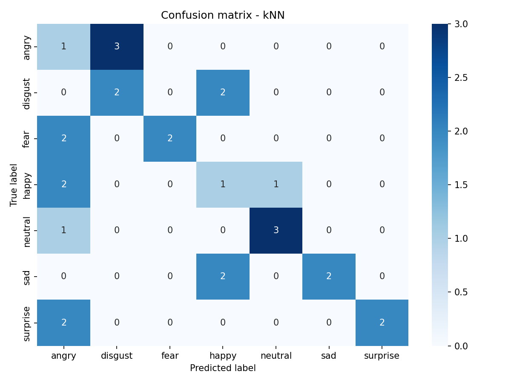
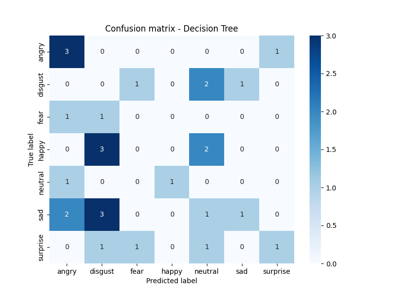
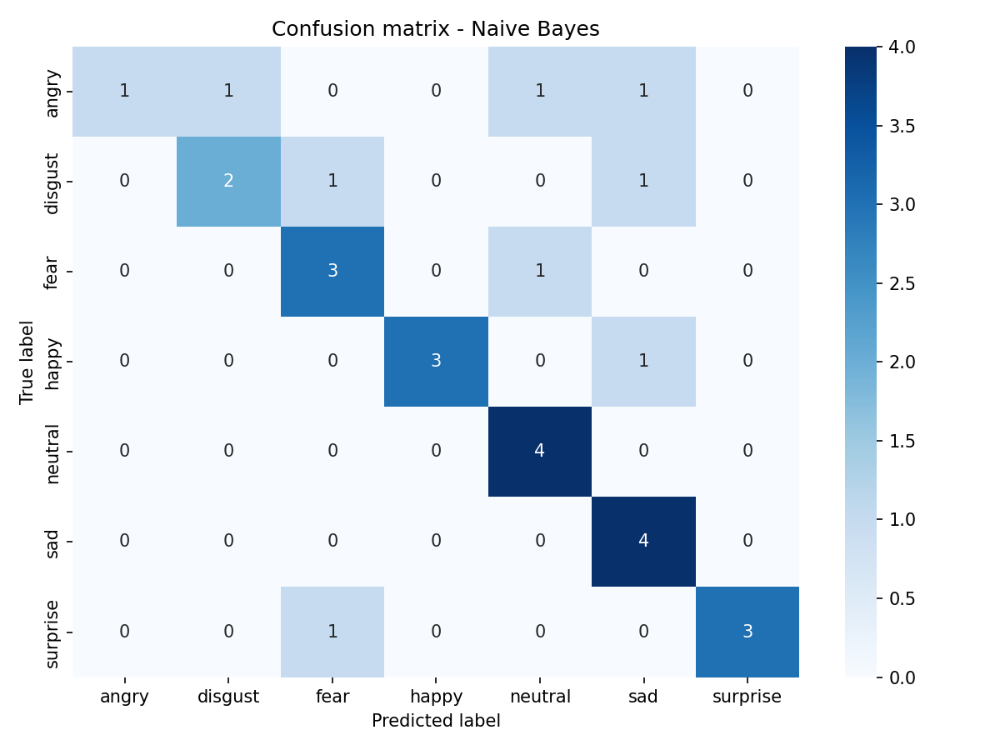

**Interpretacja.** Naiwny Bayes wyraźnie tu prowadzi. Na *małym, zrównoważonym* zbiorze
jego proste założenie gaussowskie per-piksel jest trudne do przeuczenia i wychwytuje
wystarczający sygnał. Jednak duże odchylenia standardowe w walidacji krzyżowej (±6-8 %) oraz
fakt, że zbiór testowy ma tylko 28 obrazów, sprawiają, że te różnice należy czytać z
ostrożnością - jeden błędnie sklasyfikowany obraz przesuwa dokładność o ~3,6 %. Kluczowy
wniosek z tej części jest zgodny z oczekiwaniami: **spłaszczenie obrazu do jednego długiego
wektora pikseli niszczy informację o tym, które piksele sąsiadują ze sobą w przestrzeni** (np.
że dany piksel leży tuż obok pikseli tworzących razem kontur oka). Klasyfikatory bazowe widzą
więc tylko listę liczb bez żadnego pojęcia o "sąsiedztwie", podczas gdy modele konwolucyjne
(§8.3) celowo wykorzystują właśnie tę przestrzenną bliskość pikseli.

### 8.2 Perceptrony wielowarstwowe (MLP)

Skrypt: [`src/mlp_models.py`](src/mlp_models.py)

**Co i dlaczego.** MLP to najprostsza sieć neuronowa - w pełni połączone („gęste") warstwy
na spłaszczonym wektorze pikseli. Trzy konfiguracje badają wpływ **głębokości**,
**szerokości** i **funkcji aktywacji**.

| Eksperyment | Architektura | Aktywacja | Dropout | Epoki |
|------------|--------------|------------|---------|--------|
| Płytki | Dense(128) | ReLU | – | 15 |
| Głęboki + Dropout | Dense(256) → Dense(128) | ReLU | 0,3 | 15 |
| Głęboki + Tanh | Dense(256) → Dense(128) | Tanh | 0,3 | 15 |

Wszystkie używają Adam (lr = 0,001), rzadkiej kategorycznej entropii krzyżowej, rozmiaru
wsadu 16, 10 % zbioru walidacyjnego.

**Wyniki:**

| Model | Dokładność testowa | Makro-precyzja | Makro-czułość |
|-------|--------------:|----------------:|-------------:|
| MLP płytki | 53,57 % | 0,544 | 0,536 |
| MLP głęboki (ReLU) | 42,86 % | 0,348 | 0,429 |
| MLP głęboki (Tanh) | 39,29 % | 0,257 | 0,393 |

Wyniki w okolicach 40-54 % potwierdzają, że płaskie warstwy gęste słabo pasują do danych
obrazowych: przez spłaszczenie obrazu do wektora pikseli niszczone są relacje przestrzenne
między sąsiednimi pikselami, a sieć nie ma sposobu, by je odzyskać. Wyniki są lepsze niż dla
bazowych kNN i drzewa decyzyjnego, ale MLP wciąż traktuje każdy piksel jako odosobnioną
liczbę, a nie część twarzy - co jest dokładnie tym ograniczeniem, które mają naprawić
warstwy konwolucyjne.

Macierze pomyłek:

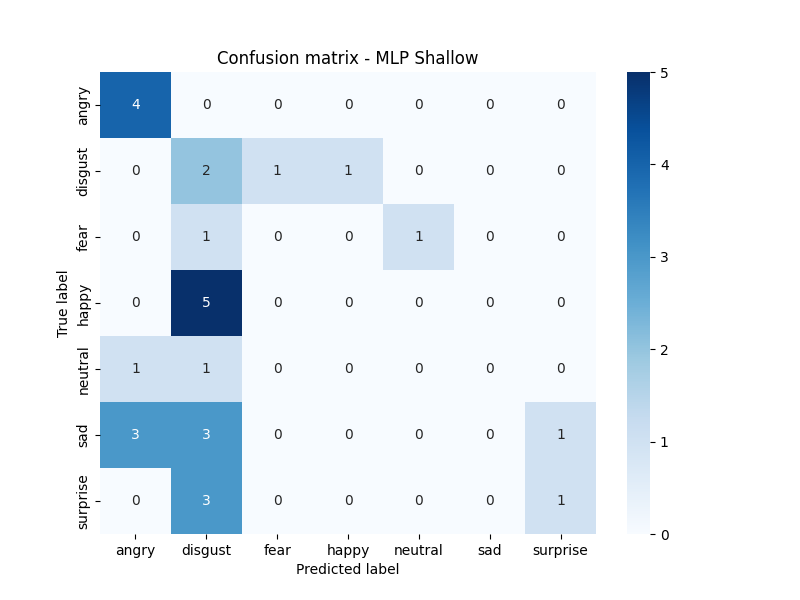
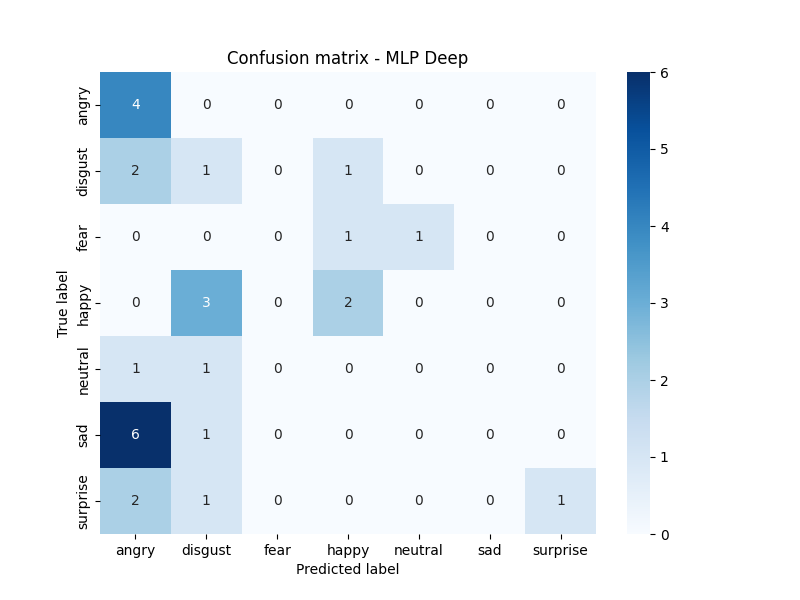
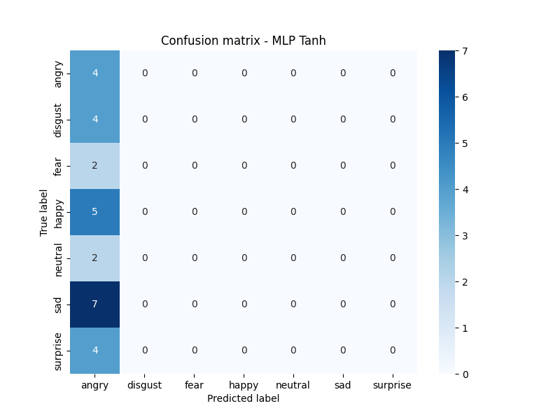

**Odczyt macierzy pomyłek.** Model płytki ma najpełniejszą przekątną (jego makro-precyzja i
makro-czułość wynoszą obie ≈ 0,54, czyli błędy rozłożone są równomiernie). Macierze głębokie,
a zwłaszcza `tanh`, zamiast tego wlewają wiele emocji w **te same kilka kolumn** - ich niska
makro-precyzja (0,35 i 0,26) to wizualny odcisk palca sieci, która zamiast rozdzielać
wszystkie siedem klas, domyślnie wybiera kilka z nich.

Połączone krzywe uczenia:

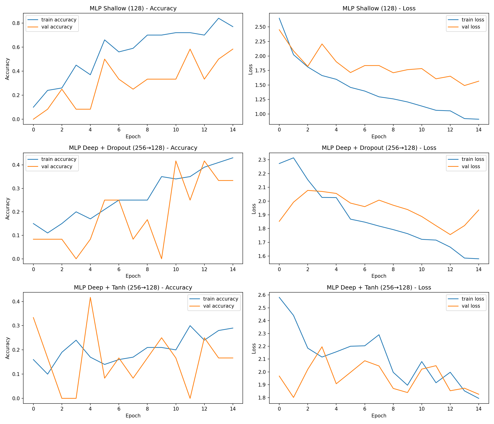

**Odczyt krzywych uczenia.** Wszystkie trzy krzywe walidacyjne są **postrzępione i nigdy się
nie ustalają** - co jest nieuniknione, gdy 10 % zbioru walidacyjnego to zaledwie ~14 obrazów,
więc pojedynczy obraz zmienia wynik o ~7 %. Dokładność treningowa modelu płytkiego rośnie
stabilnie ku ~0,8, podczas gdy głębsze warianty pozostają niskie i nieregularne - podręcznikowy
obraz **niedouczenia** przy zbyt małej ilości danych.

**Interpretacja.** Wbrew intuicji wygrywa sieć **płytka**. Mając tylko 140 obrazów, głębsze
sieci mają zbyt wiele parametrów, by uczyć się sensownie, i *niedouczają się* - dodawanie
pojemności bez dodawania danych szkodzi. `tanh` wypada najgorzej, zgodnie z oczekiwaniami:
łatwiej się nasyca niż `ReLU` i jest trudniejszy do trenowania na surowych pikselach. To
czysta demonstracja zależności **obciążenie-wariancja / rozmiar danych**.

### 8.3 Własna konwolucyjna sieć neuronowa (CNN)

Skrypt: [`src/cnn_model.py`](src/cnn_model.py)

**Co i dlaczego.** CNN to naturalne narzędzie do obrazów: zamiast spłaszczać obraz do wektora,
sieć przesuwa po nim małe filtry i uczy się **cech przestrzennych** (krawędzie → tekstury →
kształty). To wbudowane od architektury założenie - nazywane **„obciążeniem indukcyjnym"**
(czyli wiedzą o strukturze danych wbudowaną w model jeszcze przed treningiem, w tym wypadku
założeniem, że sąsiednie piksele są ze sobą powiązane) - jest dokładnie tym, czego brakowało
modelom bazowym.

Sieć zbudowano jako trzy **bloki konwolucyjne**, każdy poprzedzony poolingiem, a następnie w
pełni połączony klasyfikator:

- **Conv2D(32, 3×3)** - 32 małe filtry 3×3 przesuwają się po obrazie 48×48. Każdy filtr uczy
  się wykrywać prosty wzorzec niskopoziomowy (np. poziomą krawędź, ciemną plamkę). Wyjście:
  32 mapy cech.
- **MaxPooling2D(2×2)** - zmniejsza każdą mapę cech o połowę (bierze maksimum w każdym oknie
  2×2). Redukuje to rozmiar obrazu, zachowując najsilniej wykryte cechy, i czyni model mniej
  wrażliwym na drobne przesunięcia pozycji.
- **Conv2D(64, 3×3)** - 64 filtry zastosowane do już zredukowanych map. Na tej głębokości sieć
  łączy niskopoziomowe krawędzie z bloku 1 we wzorce średniopoziomowe (krzywe, obszary twarzy).
- **MaxPooling2D(2×2)** - kolejne zmniejszenie o połowę.
- **Conv2D(128, 3×3)** - 128 filtrów na najmniejszej skali przestrzennej. Tutaj sieć
  rozpoznaje struktury wysokopoziomowe (okolica oczu, kształt ust) specyficzne dla konkretnych
  emocji.
- **MaxPooling2D(2×2)** - finalna redukcja przestrzenna.
- **Flatten** - przekształca trójwymiarowe mapy cech w pojedynczy wektor 1D, gotowy dla
  standardowego klasyfikatora.
- **Dense(128, ReLU)** - w pełni połączona warstwa, która łączy wszystkie wykryte cechy, aby
  podjąć decyzję.
- **Dropout(0,5)** - losowo wyłącza 50 % neuronów na każdym kroku treningu, zapobiegając
  zapamiętywaniu przez sieć 112 obrazów treningowych zamiast uczenia się ogólnych wzorców.
- **Dense(7, Softmax)** - warstwa wyjściowa: jeden neuron na emocję. Softmax zamienia surowe
  wyniki w prawdopodobieństwa sumujące się do 1; emocja o najwyższym prawdopodobieństwie jest
  predykcją.

```
Wejście (48×48×1)
 → Conv2D(32, 3×3, ReLU) → MaxPool(2×2)
 → Conv2D(64, 3×3, ReLU) → MaxPool(2×2)
 → Conv2D(128, 3×3, ReLU) → MaxPool(2×2)
 → Flatten → Dense(128, ReLU) → Dropout(0,5)
 → Dense(7, Softmax)
```

Adam (lr = 0,001), rzadka kategoryczna entropia krzyżowa, rozmiar wsadu 16, **30 epok**, 10 %
walidacji.

**Wynik:** dokładność testowa = **67,86 %**, makro-precyzja = **0,798**, makro-czułość =
**0,668**.

Wysoka precyzja (0,798) względem czułości (0,668) oznacza, że model jest **ostrożny** - gdy
zobowiązuje się do predykcji, zwykle ma rację, ale czasem w ogóle nie rozpoznaje emocji
(błędnie klasyfikuje ją jako coś innego). To rozsądne zachowanie na małym zbiorze: model
nauczył się być selektywny, zamiast zgadywać agresywnie.

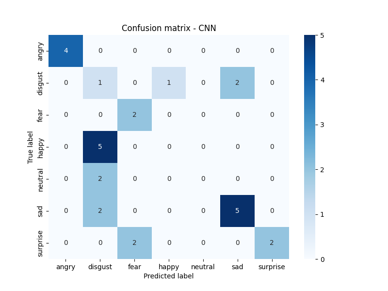

**Odczyt macierzy pomyłek.** Przekątna wyraźnie dominuje - większość klas jest klasyfikowana
poprawnie - a nieliczne błędy są rozproszone, a nie spiętrzone w jednej kolumnie. To zgadza
się z wysoką makro-precyzją (0,798): gdy CNN zobowiązuje się do etykiety, zwykle ma rację, po
prostu pomija kilka twarzy (niższa czułość 0,668).

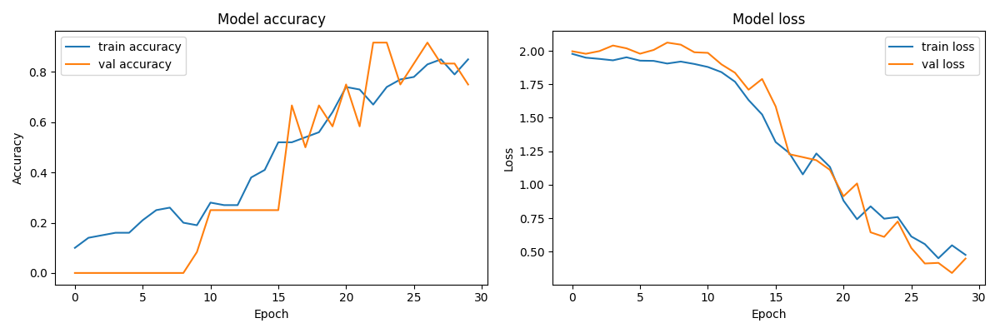

**Odczyt krzywych uczenia.** Dokładność treningowa i walidacyjna **rosną razem**, a strata
spada stabilnie do ~0,5 bez poszerzającej się luki między nimi - zdrowe uczenie bez poważnego
przeuczenia, wspomagane przez `Dropout(0,5)`. Dokładność walidacyjna na poziomie zera przez
pierwsze ~8 epok to artefakt maleńkiego 10 % zbioru walidacyjnego; gdy dokładność treningowa
przekracza ~0,25, model zaczyna trafiać te kilka odłożonych obrazów i krzywa skacze w górę.

**Interpretacja.** CNN to najsilniejszy model *neuronowy* na własnym zbiorze i drugi najlepszy
ogólnie. Krzywe uczenia pokazują stabilnie spadającą stratę oraz trening/walidację podążające
za sobą - zdrowe uczenie bez poważnego przeuczenia, wspomagane warstwą `Dropout(0,5)`.
Potwierdza to centralną hipotezę: **struktura konwolucyjna bije płaskie warstwy gęste na
obrazach**, nawet przy zaledwie 140 próbkach.

### 8.4 Uczenie transferowe - MobileNetV2 (eksperyment)

Skrypt: [`src/transfer_learning.py`](src/transfer_learning.py)

**Co i dlaczego.** Trenowanie sieci głębokiej od zera wymaga tysięcy obrazów. Przy zaledwie
140 nie jest to realistyczne dla dużej architektury. **Uczenie transferowe** rozwiązuje to,
ponownie wykorzystując sieć już wytrenowaną na zupełnie innym, ogromnym zbiorze - w tym
przypadku **ImageNet**, który zawiera 1,2 miliona kolorowych zdjęć codziennych obiektów
(koty, samochody, meble itd.). Ta sieć nauczyła się już wykrywać krawędzie, tekstury i
kształty w ogólności. Zamiast tę wiedzę wyrzucić, jest ona tu ponownie używana jako punkt
startowy.

Konkretnie: **MobileNetV2** (Sandler i in., 2018) jest wczytywany z wagami ImageNet, a jego
warstwy są **zamrożone** - czyli podczas treningu pozostają niezmienione, tak jak zostały
wytrenowane na ImageNet, i tylko nowo dodane warstwy są aktualizowane. Tą nowo dodaną,
trenowaną częścią jest mała **głowica klasyfikująca** - kilka warstw dołożonych na samej
górze sieci, które biorą gotowe cechy wykryte przez (zamrożony) MobileNetV2 i uczą się
mapować je na 7 klas emocji. Ponieważ MobileNetV2 wymaga 3-kanałowego wejścia RGB, obrazy w
skali szarości są zamieniane na „pseudo-RGB" przez trzykrotne powielenie jedynego kanału.

```
MobileNetV2 (zamrożony, wagi ImageNet, wejście 48×48×3)
 → GlobalAveragePooling2D
 → Dense(128, ReLU) → Dropout(0,3)
 → Dense(7, Softmax)
```

**GlobalAveragePooling2D** zastępuje krok `Flatten` użyty we własnym CNN (§8.3). MobileNetV2
zwraca stos map cech (małą siatkę liczb na każdą wyuczoną cechę); zamiast rozwijać całą tę
siatkę w jeden bardzo długi wektor, globalne uśrednianie bierze **średnią z każdej mapy cech**,
dając jedną liczbę na cechę. Daje to zwarty wektor o stałej długości, drastycznie mniej
parametrów w głowicy i mniejsze przeuczenie - dlatego jest to standardowy wybór na szczycie
wstępnie wytrenowanych szkieletów.

Adam (lr = 0,001), rozmiar wsadu 16, **20 epok**.

**Wynik:** dokładność testowa = **64,29 %**, makro-precyzja = **0,718**, makro-czułość =
**0,660**.

Wynik jest tylko nieco poniżej własnego CNN (67,86 %), mimo że MobileNetV2 nigdy nie był
trenowany na twarzach ani emocjach - jego zamrożone cechy pochodziły ze zdjęć obiektów.
Pokazuje to, że niskopoziomowe cechy wizualne (krawędzie, tekstury, lokalne kształty) są na
tyle uniwersalne, że przenoszą się między dziedzinami. Precyzja i czułość są bliskie sobie
(0,718 vs 0,660), co oznacza, że model popełnia błędy mniej więcej równo w obu kierunkach -
bez silnego obciążenia w stronę nadmiernego lub niedostatecznego przewidywania
którejkolwiek z emocji.

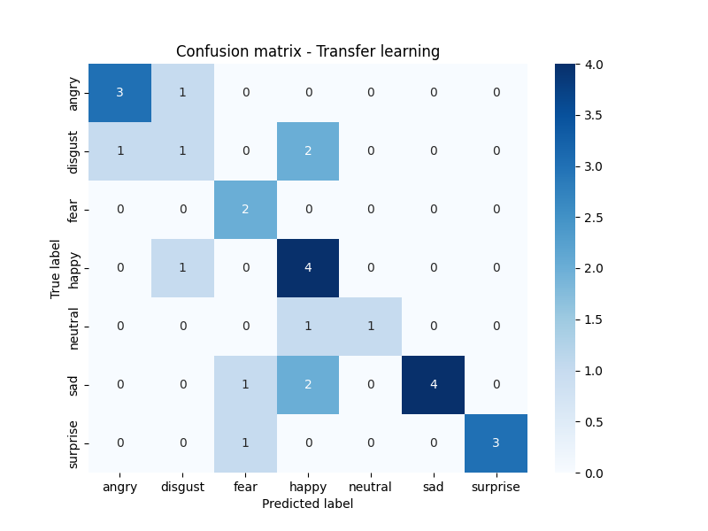

**Odczyt macierzy pomyłek.** Przekątna jest silna, ale nieco mniej czysta niż w CNN, a błędy
są dość równomiernie rozłożone po klasach (makro-precyzja 0,718 ≈ czułość 0,660) - żadna
pojedyncza emocja nie dominuje w pomyłkach, więc model jest zrównoważony, a nie zapadnięty w
jedną klasę.

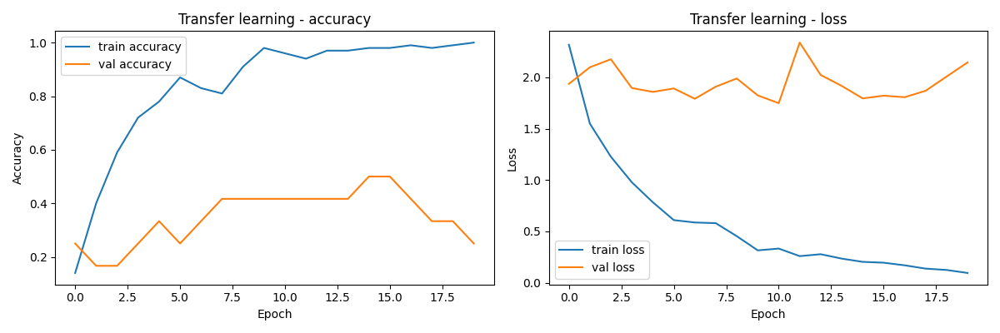

**Odczyt krzywych uczenia.** Tutaj krzywe się **rozchodzą**: dokładność treningowa pędzi do
100 %, podczas gdy walidacyjna stabilizuje się w okolicy 55-58 %, a strata walidacyjna
spłaszcza się przy ~1,3 - podręcznikowa **luka przeuczenia**. Zamrożone cechy ImageNet idealnie
dopasowują się do 112 kadrów treningowych, ale generalizują tylko umiarkowanie na te odłożone -
oczekiwana konsekwencja niedopasowania dziedzin (obiekty → twarze) na małym zbiorze.

**Interpretacja.** Wynik jest nieco poniżej własnego CNN, ale model szybko osiąga zbieżność i
nie wymaga ręcznego projektowania architektury. Haczykiem jest **niedopasowanie dziedzin**: cechy ImageNet wyuczono na dużych,
kolorowych obrazach naturalnych, podczas gdy tutaj są małe twarze 48×48 w skali szarości -
więc wstępnie wytrenowane cechy są tylko częściowo istotne. Mimo to przebicie 60 % z zamrożonym
szkieletem potwierdza, że cechy ImageNet są użytecznym ogólnym priorytetem wizualnym.

### 8.5 Vision Transformer (ViT)

Skrypt: [`src/vit_model.py`](src/vit_model.py)

**Co i dlaczego.** CNN przetwarzają obrazy, przesuwając małe filtry po sąsiednich pikselach -
mają wbudowane założenie, że pobliskie piksele są powiązane. **Vision Transformer**
(Dosovitskiy i in., 2021) przyjmuje zupełnie inne podejście: zapożycza architekturę
**Transformer** z przetwarzania języka naturalnego (ta sama idea stoi za dużymi modelami
językowymi jak GPT). Zamiast patrzeć na lokalne fragmenty pikseli filtrami, patrzy na wszystkie
części obrazu **jednocześnie** i uczy się, które części są dla siebie istotne - nazywa się to
**samouwagą (self-attention)**.

Idea: jeśli model klasyfikuje wściekłą twarz, może potrzebować odnieść kształt brwi do kształtu
ust - czyli dwóch fragmentów obrazu, które są od siebie oddalone. Mechanizm samouwagi pozwala
modelowi uczyć się takich dalekosiężnych zależności bezpośrednio, zamiast być ograniczonym do
niewielkiego okna filtra 3×3, jak ma to miejsce w CNN.

Zaimplementowano własny mini-ViT od zera, aby przetestować tę nowoczesną architekturę na tym
problemie:

1. **Ekstrakcja fragmentów** - obraz 48×48 jest cięty na 36 małych fragmentów 8×8. Każdy fragment traktowany jest jako jeden „token" - analogicznie do
   słowa w zdaniu.
2. **Osadzanie fragmentów** - każdy fragment (64 piksele) jest rzutowany na 64-wymiarowy
   wektor, by Transformer mógł go przetworzyć.
3. **Kodowanie pozycyjne** - Transformer nie ma pojęcia o kolejności ani pozycji, więc
   dodawane są uczone osadzenia pozycji, by powiedzieć mu, skąd w obrazie pochodzi każdy
   fragment.
4. **Enkoder Transformera** - 2 bloki self-attention: każdy fragment „patrzy na" wszystkie inne
   fragmenty i decyduje, ile uwagi poświęcić każdemu z nich. 4 głowice uwagi robią to
   równolegle, każda skupiając się na innych relacjach.
5. **Głowica klasyfikująca** - powstałe reprezentacje fragmentów są uśredniane i przepuszczane
   przez warstwę Dense(7, softmax), aby wytworzyć predykcję emocji.

Adam (lr = 0,001), rozmiar wsadu 16, **40 epok**.

**Wynik:** dokładność testowa = **17,86 %**, makro-precyzja = **0,327**, makro-czułość =
**0,192**.

Dokładność 17,86 % jest ledwie powyżej losowego progu 14,3 % - model nauczył się niemal niczego.
Luka między precyzją (0,327) a czułością (0,192) ujawnia tryb porażki: gdy model już coś
przewiduje, czasem ma rację (precyzja niezła), ale pomija zdecydowaną większość prawdziwych
przypadków (czułość bardzo niska). W praktyce model się zapada - przewiduje tylko kilka
dominujących klas i całkowicie ignoruje resztę.

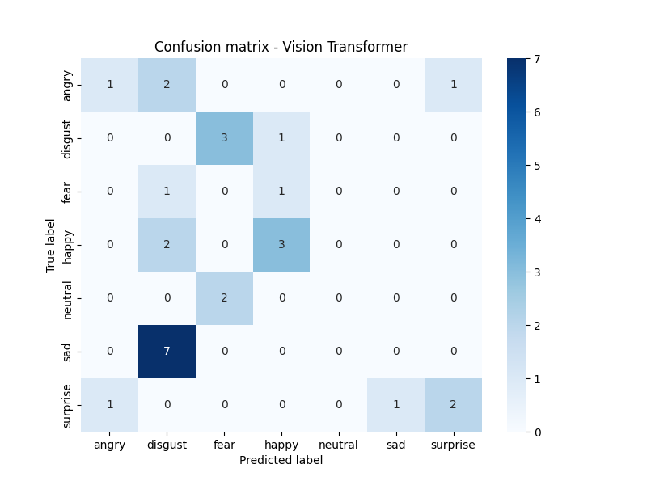

**Odczyt macierzy pomyłek.** Ta macierz jest dokładnym przeciwieństwem macierzy "zdrowego"
modelu: predykcje skupiają się w zaledwie kilku kolumnach, a większa część przekątnej
pozostaje pusta. Model **zapadł się w kilka dominujących klas** i całkowicie ignoruje resztę -
dokładnie to mierzy bardzo niska czułość (0,192).

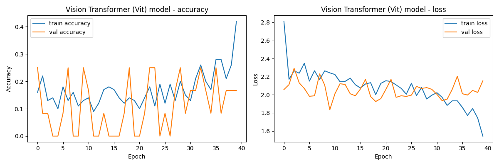

**Odczyt krzywych uczenia.** Obie krzywe są gwałtownie **nieregularne i w zasadzie płaskie** -
dokładność walidacyjna skacze między 0 a 0,25 z epoki na epokę i nigdy nie zbiega, podczas gdy
strata ledwie się rusza. Sieć nigdy nie stabilizuje się w spójnym odwzorowaniu obraz → emocja -
to oczekiwane zachowanie modelu typu transformer, który z natury potrzebuje bardzo dużo danych,
a tutaj ich nie dostał.

**Interpretacja.** ViT wypada ledwie powyżej losowego progu 14,3 % - i jest to wynik
**oczekiwany i pouczający**. Transformery nie mają *żadnych wbudowanych założeń o obrazach* -
w przeciwieństwie do CNN nie zakładają z góry ani że sąsiednie piksele są ze sobą powiązane
(brak lokalności), ani że ten sam wzorzec wygląda tak samo niezależnie od miejsca w obrazie
(brak niezmienniczości na przesunięcie) - więc muszą nauczyć się wszystkiego od podstaw, tylko
z danych. Są dobrze znane z tego, że są **głodne danych**, zwykle potrzebując dziesiątek
tysięcy do milionów obrazów.
Krzywe uczenia są nieregularne, a model nigdy nie zbiega. **Ten eksperyment jest cenny właśnie
dlatego, że zawodzi:** pokazuje *dlaczego* najnowocześniejsza architektura może być
złym wyborem, gdy danych jest mało, i wprost motywuje wybór wstępnie wytrenowanego CNN
(MobileNetV2) do produkcji.

### 8.6 Warunkowy DCGAN (bonus generatywny)

Skrypt: [`src/gan_model.py`](src/gan_model.py)

**Co i dlaczego (bonus z AI generatywnej).** Wszystkie poprzednie modele w tym raporcie to
**klasyfikatory** - biorą obraz i zwracają etykietę. **GAN (generatywna sieć przeciwstawna)**
robi coś przeciwnego: uczy się **generować nowe obrazy od zera**. Celem było tu wygenerowanie
syntetycznych zdjęć twarzy dla wybranej emocji, które w zasadzie mogłyby posłużyć do
rozszerzenia małego zbioru.

GAN działa, trenując dwie sieci, które rywalizują ze sobą:

- **Generator** - startuje od losowego wektora szumu (100 losowych liczb) plus etykiety emocji
  i próbuje wytworzyć realistycznie wyglądający obraz twarzy 48×48. Nigdy nie widział prawdziwej
  twarzy - musi sam wymyślić, jak ona wygląda, czysto na podstawie otrzymywanej informacji
  zwrotnej.
- **Dyskryminator** - patrzy na obraz (prawdziwy ze zbioru lub wygenerowany) i jego etykietę
  emocji, po czym zwraca jedną odpowiedź: *prawdziwy czy fałszywy?*

Obie sieci grają w grę: Generator próbuje oszukać Dyskryminatora, by uznał jego obrazy za
prawdziwe; Dyskryminator próbuje wyłapać fałszywki. Z czasem Generator jest zmuszony wytwarzać
coraz bardziej realistyczne obrazy, by dalej go oszukiwać. Ta dynamika przeciwstawna sprawia, że
GAN-y potrafią generować fotorealistyczne obrazy.

Część **warunkowa** oznacza, że obie sieci otrzymują etykietę emocji - więc Generatorowi można
powiedzieć *„wygeneruj wściekłą twarz"*, a nie tylko *„wygeneruj jakąkolwiek twarz"*.

Architektura Generatora używa warstw `Conv2DTranspose` - odwrotności konwolucji, która
**zwiększa rozdzielczość** małej reprezentacji do pełnowymiarowego obrazu krok po kroku.
Dyskryminator używa standardowych warstw `Conv2D`, by analizować obraz.

Obie sieci trenowane są razem przez 50 epok na augmentowanym zbiorze 140 obrazów. Próbki
zapisywano co 10 epok do [`results/gan_progress/`](results/gan_progress/).

**Wygenerowane próbki po 50 epokach (jedna na emocję):**

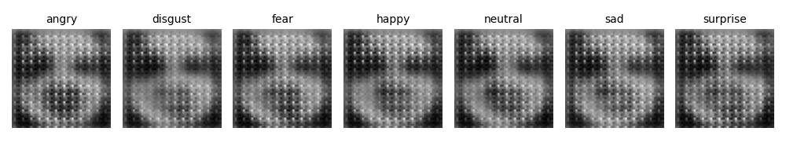

**Interpretacja.** Generator uczy się **globalnej struktury twarzy** - wyraźnie widoczny jest
wyśrodkowany owal z ciemniejszymi obszarami oczu/ust - ale wyjścia są **rozmyte** i widać na
nich **artefakty szachownicy** (wzór przypominający szachownicę, powstający, gdy konwolucja
transponowana zwiększa rozdzielczość obrazu nierównomiernie). Siedem klas emocji **nie jest
jeszcze wizualnie rozróżnialnych** między sobą. To oczekiwane: GAN-y są notorycznie głodne
danych i wymagają starannego dostrajania, by uniknąć **załamania trybu (mode collapse)** (gdy
Generator znajduje jedno wyjście, które zawsze oszukuje Dyskryminatora, i przestaje
różnicować). Przy zaledwie 140 obrazach treningowych po prostu nie ma wystarczająco sygnału.
Jako **dowód koncepcji** eksperyment się udaje - demonstruje pełną pętlę treningu GAN z dwiema
rywalizującymi sieciami - a jednocześnie szczerze pokazuje granice tego, co modelowanie
generatywne może osiągnąć na tak małym zbiorze danych.

---

## 9. Zbiorcze porównanie wyników

Wszystkie metryki zapisane są w [`results/model_metrics.csv`](results/model_metrics.csv).

| Model | Zbiór | Dokł. test. | Makro-prec. | Makro-czuł. | Dokł. CV |
|-------|---------|----------:|------------:|-----------:|--------:|
| kNN (k=3) | własny (140) | 46,43 % | - | - | 56,43 % ± 8,27 % |
| Drzewo decyzyjne | własny (140) | 46,43 % | - | - | 42,14 % ± 6,14 % |
| **Naiwny Bayes** | własny (140) | **71,43 %** | - | - | 65,00 % ± 7,95 % |
| MLP płytki | własny (140) | 53,57 % | 0,544 | 0,536 | - |
| MLP głęboki (ReLU) | własny (140) | 42,86 % | 0,348 | 0,429 | - |
| MLP głęboki (Tanh) | własny (140) | 39,29 % | 0,257 | 0,393 | - |
| **Własny CNN** | własny (140) | **67,86 %** | **0,798** | **0,668** | - |
| MobileNetV2 (TL) | własny (140) | 64,29 % | 0,718 | 0,660 | - |
| Vision Transformer | własny (140) | 17,86 % | 0,327 | 0,192 | - |
| MobileNetV2 (finalny) | FER-2013 | 37,38 % | 0,328 | 0,360 | - |

**Kluczowe obserwacje:**

1. **Naiwny Bayes osiąga najwyższy wynik** na własnym zbiorze testowym (71,4 %), ale na zaledwie
   28 obrazach testowych mieści się to w paśmie szumu - nie należy tego nadinterpretować jako
   „najlepszego modelu w ogóle".
2. **Własny CNN jest najsilniejszym, najbardziej niezawodnym uczniem** (67,9 %, zdrowe krzywe
   uczenia): obciążenie indukcyjne konwolucji opłaca się nawet przy małej ilości danych.
3. **Głębiej nie znaczy lepiej** - zarówno głębokie MLP, jak i ViT wypadają gorzej niż ich
   prostsze odpowiedniki, bo zbiór jest zbyt mały, by nakarmić ich pojemność.
4. **Niemal losowy wynik ViT to cecha, a nie błąd** badania: empirycznie pokazuje głód danych
   modeli opartych na mechanizmie uwagi (ang. *attention*, czyli mechanizmie samouwagi
   opisanym w §8.5, na którym opiera się architektura Transformera/ViT).

---

## 10. Finalny model produkcyjny - MobileNetV2 na FER-2013

Skrypt: [`src/final_train.py`](src/final_train.py) · Zapisany model: `models/final_emotion_model.h5`

### Dlaczego to ten model napędza aplikację (a nie naiwny Bayes)

Porównanie w §8 stawia naiwny Bayes i własny CNN najwyżej *na 140 własnych obrazach*. Dlaczego
więc wdrożyć MobileNetV2 trenowany na FER-2013? - Bo **metryka porównawcza i wymóg wdrożeniowy to
dwie różne sprawy**:

- Modele na 140 obrazach są dostrojone do *tych konkretnych 28 twarzy testowych*. Mając tak mało
  przykładów, **nie zgeneralizują** na dowolne zdjęcia z kamery nieznanych użytkowników.
- Model produkcyjny musi być trenowany na **tysiącach zróżnicowanych twarzy**, by być odporny.
  FER-2013 (28 709 obrazów treningowych) zapewnia dokładnie taką skalę, a **MobileNetV2 to
  jedyna testowana architektura, która łączy odporność z wstępnego trenowania, szybką zbieżność i
  mały, wdrażalny rozmiar** odpowiedni dla aplikacji czasu rzeczywistego.

Krótko: §8 odpowiada na pytanie *„który algorytm uczy się najlepiej z maleńkiego zbioru?"*; §10
odpowiada na *„który model powinien trafić do produkcji?"*. To celowo osobne pytania.

### Konfiguracja

```
MobileNetV2 (zamrożony, wagi ImageNet, wejście 48×48×3)
 → GlobalAveragePooling2D
 → Dense(256, ReLU) → Dropout(0,4)
 → Dense(7, Softmax)
```

- Optymalizator: Adam (lr = 0,0005); strata: kategoryczna entropia krzyżowa; rozmiar wsadu: 64;
  maks. 50 epok.
- **Zbalansowane wagi klas** (`compute_class_weight`, `class_weight='balanced'`) - wagi nie są
  dobierane ręcznie; każda jest obliczana automatycznie jako
  `n_samples / (n_classes × class_count)`, więc rzadkie klasy są wzmacniane odwrotnie
  proporcjonalnie do swojej częstości. Przy rozkładzie FER-2013 daje to zakres od
  **`wstręt` ≈ 9,4** (436 obrazów) do **`radość` ≈ 0,57** (7215 obrazów), zmuszając model do
  zwracania ~16× większej uwagi na obraz `wstrętu` niż `radości`, tak by nie mógł ignorować
  rzadkich klas.
- **Callbacki:** `EarlyStopping(patience=5, restore_best_weights=True)` oraz
  `ModelCheckpoint(monitor='val_accuracy')`.
- Obrazy treningowe augmentowane w potoku (obrót ±20°, zoom ±20 %, odbicie poziome); obrazy
  testowe tylko przeskalowane.

**Wynik:** dokładność testowa = **37,38 %**, makro-precyzja = **0,328**, makro-czułość =
**0,360**. Wczesne zatrzymanie uruchomiło się po ~16 epokach.

**Dlaczego 37 % to rozsądny wynik, a nie słaby.** Liczba wygląda na niską tylko obok 68 %
własnego CNN, ale te dwa są nieporównywalne: własny CNN oceniano na **28 obrazach z rozkładu
treningowego** z tego samego maleńkiego zbioru, na którym się uczył, podczas gdy ten model
oceniany jest na **7178 niewidzianych twarzach FER-2013** obejmujących znacznie więcej osób,
warunków oświetleniowych i kątów - to prawdziwy test generalizacji. Trzy rzeczy stawiają 37 % w
kontekście: (1) FER-2013 to notorycznie trudny, zaszumiony etykietami benchmark, gdzie nawet
**dokładność człowieka wynosi tylko ~65 %**, a proste bazowe transfery z zamrożonym szkieletem w
literaturze zwykle lądują w przedziale **40-60 %**; (2) wynik to **~2,6× losowy próg 14,3 %**,
więc model wyraźnie nauczył się prawdziwego sygnału, a nie zgaduje; oraz (3) jak pokazuje §10.1,
**większość pozostałego błędu to pomyłki między sąsiadującymi emocjami** (strach/smutek/złość), a
nie rażące błędy - zwinięcie do poziomu walencji odzyskuje już ~64 %. Bliskość makro-precyzji i
makro-czułości (0,328 vs 0,360) potwierdza, że model **nie zawyża dokładności przez zapadnięcie w
jedną klasę**, choć pozostaje resztkowe nachylenie ku `radości`, co widać na macierzy pomyłek.

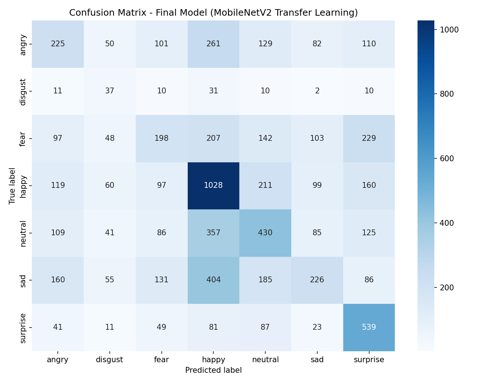

**Odczyt macierzy pomyłek.** Przekątna jest najsilniejsza dla `radości` i `zaskoczenia` - są one
rozpoznawane niezawodnie - podczas gdy `wstręt` praktycznie nigdy nie jest odzyskiwany, co nie
dziwi, biorąc pod uwagę, że ma tylko 436 obrazów treningowych. Dominującym błędem jest
**nachylenie ku `radości`**: wiele twarzy `złości`, `strachu`, `neutralności` i `smutku` jest
odczytywanych jako `radość` - odcisk palca niezrównoważenia FER-2013 przetrwał nawet po
ważeniu klas. Emocje negatywne także zlewają się ze sobą (strach ↔ smutek ↔ złość) - dokładnie
ta wewnątrzkategorialna pomyłka, którą kwantyfikuje §10.1.

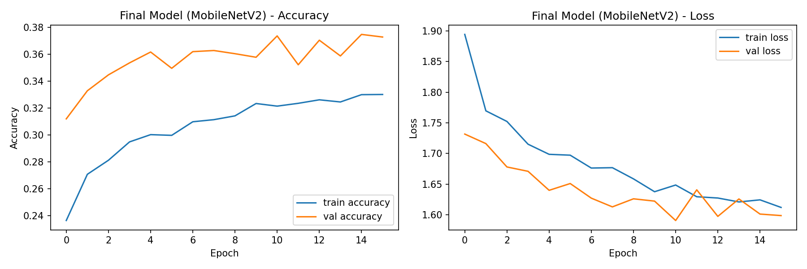

**Odczyt krzywych uczenia.** Dokładność walidacyjna **wciąż rośnie, a nawet znajduje się powyżej
dokładności treningowej**, gdy wczesne zatrzymanie kończy trening - sygnatura **niedouczenia, a
nie przeuczenia**. Model wciąż miał się czego uczyć, ale zamrożony szkielet go ogranicza: skoro
warstwy MobileNetV2 nie mogą dostosować swoich cech do twarzy, mała trenowalna głowica szybko
przestaje się poprawiać i osiąga **plateau** (czyli wypłaszczenie krzywej - dalsze epoki nie
przynoszą już zauważalnej poprawy).

### Interpretacja (uczciwa)

Wąskim gardłem jest **zamrożony szkielet**: cechy ImageNet przy 48×48 w skali szarości po prostu
nie są wystarczająco ekspresyjne, a mała trenowalna głowica nie potrafi tego zrekompensować.
FER-2013 to autentycznie trudny benchmark, ale najbardziej wpływowym usprawnieniem dostępnym tutaj
byłoby **odmrożenie i dostrojenie górnych warstw MobileNetV2** (zob. §15).

### 10.1 Analiza agregacji emocji (2 klasy)

Skrypt: [`src/emotion_aggregation.py`](src/emotion_aggregation.py)

Liczba 37 % mierzy *najtrudniejsze* możliwe zadanie: rozróżnienie siedmiu emocji, z których kilka
jest wizualnie niemal identycznych (`strach` vs `smutek` vs `złość`). Naturalne pytanie brzmi:
**ile z tego błędu to autentyczna porażka, a ile to po prostu pomyłka między sąsiadującymi
emocjami?** Aby na nie odpowiedzieć, **ten sam wytrenowany model 7-klasowy** jest ponownie
oceniany po zwinięciu predykcji w **dwie grupy**. Nie ma tu ponownego treningu: surowe predykcje
modelu na 7178 obrazach testowych są po prostu przegrupowywane, więc jakakolwiek poprawa wynika
czysto z *zadania łatwiejszego, grubszego pytania* - dokładnie tego pytania, które naprawdę
interesuje rekomender muzyki.

Przetestowano trzy schematy, dwa z nich osadzone w **modelu kołowym Russella** (ten sam
framework pobudzenie-walencja, który steruje regułami asocjacyjnymi w §11):

| Schemat | Grupa A | Grupa B |
|--------|---------|---------|
| **Walencja** (poz/neg) | radość, zaskoczenie, neutralność | złość, wstręt, strach, smutek |
| **Radość vs reszta** (jeden-kontra-reszta) | radość | wszystkie pozostałe sześć |
| **Pobudzenie** (wysokie/niskie) | złość, strach, radość, zaskoczenie | wstręt, neutralność, smutek |

**Wyniki** (post-hoc, identyczny model i predykcje):

| Schemat | Dokładność | Makro-F1 | Zbalans. dokł. |
|--------|---------:|---------:|--------------:|
| 7-klasowy (bazowy) | 37,5 % | 0,334 | 0,373 |
| **Walencja (poz/neg)** | **64,5 %** | **0,637** | **0,638** |
| Radość vs reszta | 72,5 % | 0,651 | 0,662 |
| Pobudzenie (wys./nis.) | 64,4 % | 0,606 | 0,605 |

**Interpretacja wyników.** Przegrupowanie *tych samych* predykcji podnosi dokładność z 37 % do
**~64 %** na podziale walencji i do **72 %** dla wyodrębnienia radości. Wielkość tego skoku
pokazuje, że **duża część błędu 7-klasowego była pomyłką wewnątrz grupy** - np. twarz `smutku`
błędnie oznaczona jako `strach`, co jest błędem przy siedmiu klasach, ale poprawne, gdy obie
liczą się jako *negatywne* - a nie rażącym myleniem pozytyw/negatyw. Dwa zastrzeżenia utrzymują
odczyt w ryzach: dla `radość vs reszta` zwykła dokładność jest zawyżana przez większościową grupę
„reszta", więc **makro-F1 (0,651) i zbalansowana dokładność (0,662)** to rzetelne metryki; a
spośród trzech **walencja jest najbardziej zrównoważonym i najlepiej bronionym** schematem
(precyzja i czułość bliskie po obu stronach). Wynik jest też **istotny produktowo** - rekomender
z §11 działa wzdłuż osi walencji i pobudzenia, więc niezawodny 64 % klasyfikator walencji jest
*bliższy temu, czego system naprawdę potrzebuje*, niż kruchy 37 % klasyfikator siedmioklasowy.

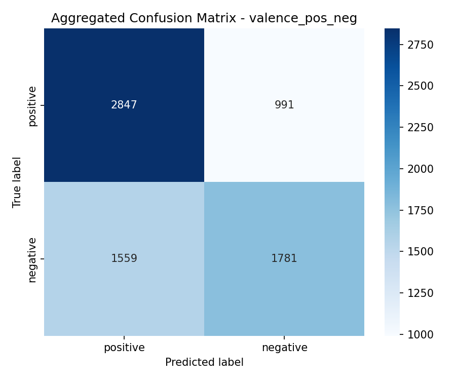
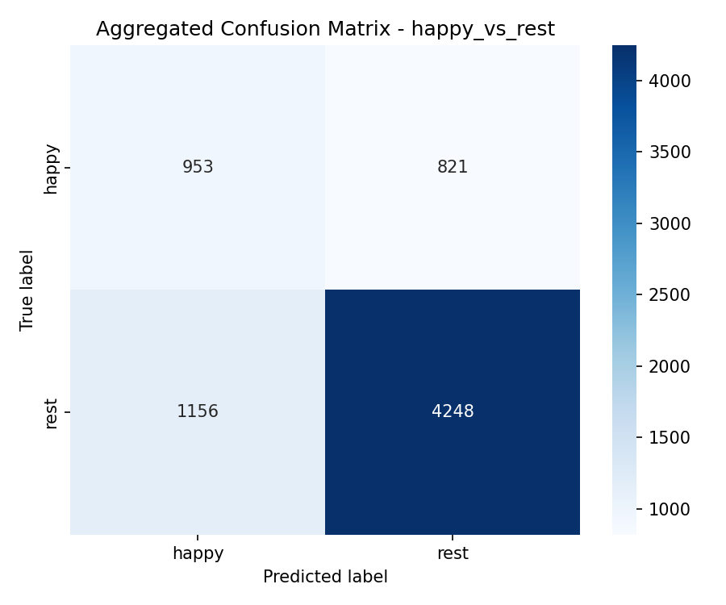
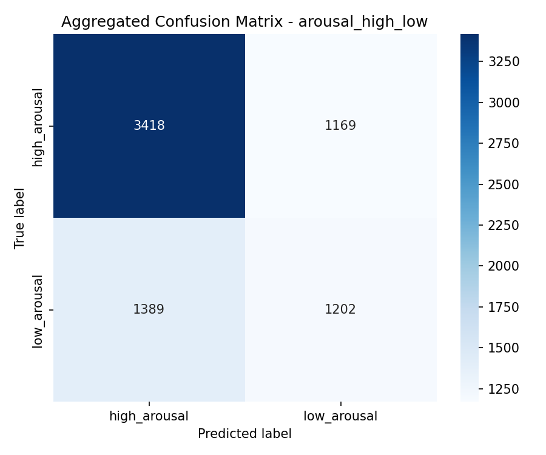

**Odczyt macierzy pomyłek.** Macierze 2×2 uwidaczniają resztkowy błąd i jego **asymetrię**. Na
podziale walencji twarze pozytywne są rozpoznawane dobrze (czułość 0,74), ale **~47 % twarzy
negatywnych wciąż jest wciąganych do grupy pozytywnej** (czułość negatywnych 0,53) - utrzymujące
się nachylenie ku `radości` z §10 przeciekające nawet po agregacji. Macierz `radość vs reszta`
pokazuje przeciwną nierównowagę: duża grupa „reszta" jest wychwytywana czysto (czułość 0,79),
podczas gdy prawdziwe twarze `radości` są łapane tylko ~54 % razy, co właśnie dlatego jej wysoka
dokładność 72 % musi być czytana razem z niższym makro-F1. Macierz pobudzenia jest najsłabszą z
trzech (czułość niskiego pobudzenia 0,46), bo wymusza umieszczenie wizualnie sąsiadujących emocji
jak `smutek` i `neutralność` po przeciwnych stronach podziału.

### 10.2 Trenowanie bezpośrednio na etykietach 2-klasowych (walencja)

Skrypt: [`src/binary_train.py`](src/binary_train.py) · Zapisany model: `models/binary_emotion_model.h5`

Liczby z §10.1 są **post-hoc**: przegrupowują model, który był *trenowany* do rozdzielania siedmiu
emocji. Naturalnym następstwem jest **trenowanie MobileNetV2 bezpośrednio na dwóch etykietach
walencji**, tak by binarny cel był optymalizowany od początku do końca. Architektura, augmentacja,
wagi klas i callbacki są identyczne jak w §10; zmienia się tylko głowica na dwa neurony wyjściowe,
a foldery emocji FER-2013 są remapowane na `positive`/`negative` w locie (żadne obrazy nie są
kopiowane). Trening zatrzymał się przez wczesne zatrzymanie po 25 epokach.

| Podejście | Dokładność | Makro-F1 |
|----------|---------:|---------:|
| Agregacja walencji post-hoc (§10.1) | 64,5 % | 0,637 |
| **Trening binarny od początku do końca** | **65,9 %** | **0,652** |

**Interpretacja wyników.** Trening od początku do końca daje tylko **skromny zysk** (+1,4 pp
dokładności, +0,015 makro-F1) względem zwykłego przegrupowania predykcji 7-klasowych. To samo w
sobie jest informatywne: potwierdza, że **zamrożony szkielet ImageNet to wspólne wąskie gardło** -
to samo niedouczenie zdiagnozowane w §10 ogranicza oba modele, a optymalizacja celu binarnego nie
może wydobyć cech, których szkielet nigdy nie wytworzył. Wniosek: dla wdrożenia 2-klasowego tania
agregacja post-hoc jest *niemal tak dobra* jak dedykowany model, a najwyżej dźwigniowym
usprawnieniem dla obu granularności jest to samo - **dostrojenie górnych warstw MobileNetV2** (§15),
a nie zmiana liczby klas wyjściowych.

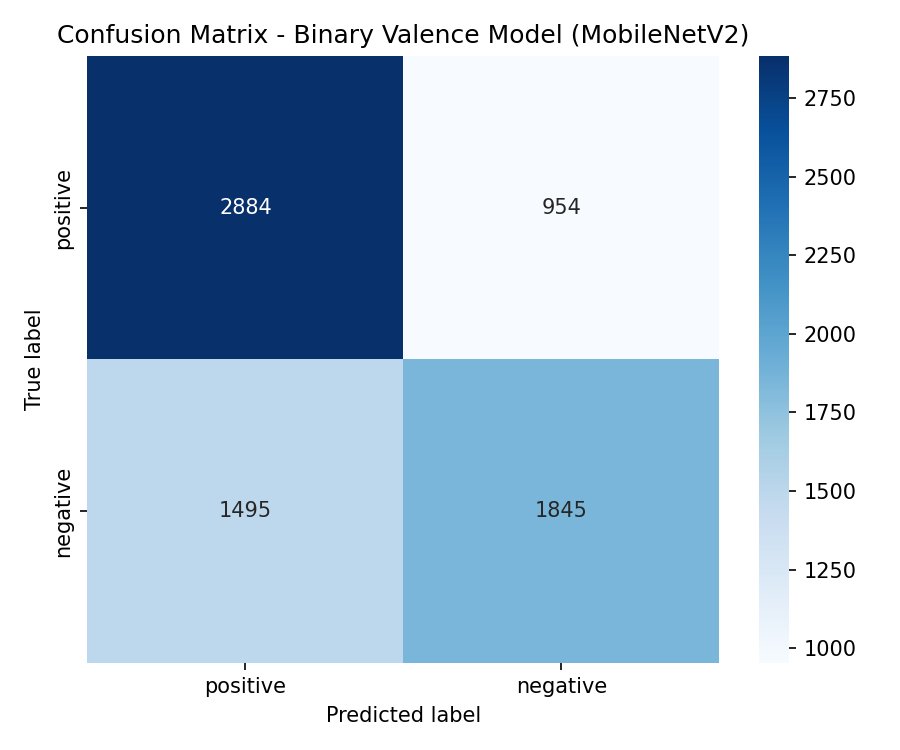

**Odczyt macierzy pomyłek.** Macierz pokazuje **tę samą asymetrię** co post-hoc podział walencji
(§10.1): czułość pozytywnych pozostaje wysoka (0,75), podczas gdy twarze negatywne wciąż są
niedoodzyskiwane (czułość 0,55). Trening bezpośrednio na etykietach binarnych przesuwa liczby tylko
nieznacznie, zamiast naprawić leżące u podstaw nachylenie ku `radości` odziedziczone po szkielecie.

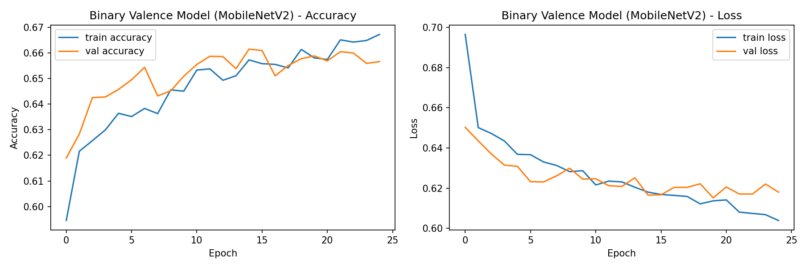

**Odczyt krzywych uczenia.** Dokładność treningowa i walidacyjna rosną razem do ~0,66, a
następnie **szybko przestają się poprawiać i osiągają plateau** (wypłaszczają się), przy czym
walidacja podąża - a przez dużą część przebiegu nawet znajduje się powyżej - za treningiem. To po raz kolejny sygnatura **niedouczenia** spowodowanego
zamrożonym szkieletem, co właśnie dlatego dostrajanie (a nie ponowne etykietowanie) jest kolejnym
krokiem.

---

## 11. Odkrywanie reguł asocjacyjnych (Apriori)

Skrypt: [`src/association_rules.py`](src/association_rules.py)

### Motywacja

Wykrycie emocji to tylko połowa systemu - musi ona zostać **przełożona na muzykę**. Łącznik
zbudowano za pomocą **odkrywania reguł asocjacyjnych**, używając algorytmu **Apriori**
(Agrawal & Srikant, 1994) do odkrywania reguł statystycznych postaci *emocja → atrybut muzyki*.

### Dane

Rzeczywiste logi słuchania użytkowników nie były dostępne, więc wygenerowano **1500 syntetycznych
sesji słuchania** z mapowań emocja→muzyka osadzonych w badaniach psychologii muzyki (model
pobudzenie-walencja Russella; Grekow, 2016). Każda sesja to transakcja, np.
`{radość, szybkie_tempo, tonacja_durowa, wysoka_energia}`. Wstrzyknięto **10 % losowego szumu**
(zamiana tempa), by naśladować rzeczywistą zmienność, tak aby reguły nie były trywialnie idealne.

| Emocja | Tempo | Tonacja | Energia |
|---------|-------|-----|--------|
| radość | szybkie | durowa | wysoka |
| smutek | wolne | molowa | niska |
| złość | szybkie | molowa | wysoka |
| neutralność | wolne | durowa | niska |
| zaskoczenie | szybkie | durowa | wysoka |
| strach | szybkie | molowa | niska |
| wstręt | wolne | molowa | niska |

### Parametry i wyniki

| Parametr | Wartość |
|-----------|-------|
| Algorytm | Apriori (`mlxtend`) |
| Min. wsparcie | 0,05 |
| Min. zaufanie | 0,70 |

Odkryto **49 reguł** (pełna lista w
[`results/music_association_rules.csv`](results/music_association_rules.csv)). *Wsparcie* = jak
często zbiór elementów się pojawia; *zaufanie* = P(następnik | poprzednik); *lift* = o ile
częściej niż przy losowości oba współwystępują (lift > 1 oznacza realną dodatnią asocjację).

Najsilniejsze przykładowe reguły:

| Reguła | Zaufanie | Lift |
|------|:----------:|-----:|
| złość → {wysoka_energia, tonacja_molowa} | 1,00 | 6,79 |
| strach → {szybkie_tempo, niska_energia, tonacja_molowa} | 0,89 | 7,37 |
| neutralność → {wolne_tempo, tonacja_durowa, niska_energia} | 0,92 | 6,36 |
| radość → {tonacja_durowa, wysoka_energia} | 1,00 | 3,41 |
| smutek → {wolne_tempo, niska_energia, tonacja_molowa} | 0,89 | 3,17 |

Dwie reguły z zaufaniem 1,00 (`złość`, `radość`) oznaczają, że asocjacja utrzymała się w każdej
pojedynczej sesji w zbiorze - bez wyjątku. Wartości lift są bardziej informatywnym sygnałem:
`strach` z liftem 7,37 oznacza, że szybka, niskoenergetyczna muzyka w tonacji molowej
współwystępuje ze strachem **7× częściej niż zdarzyłoby się to przez przypadek**, co potwierdza
autentyczny, silny wzorzec, a nie zbieg okoliczności. Reguły dla `smutku` i `radości` mają niższy
lift (3,17-3,41), bo ich atrybuty muzyczne (odpowiednio wolne/molowe i szybkie/durowe) są dzielone
także z innymi emocjami, co czyni je mniej wyłącznymi.

Mapa cieplna zaufania (emocja × atrybut muzyki):

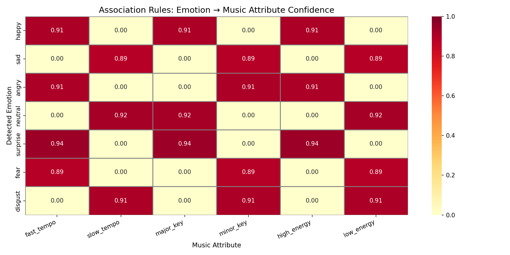

**Interpretacja.** Apriori z powodzeniem odtwarza psychologicznie oczekiwaną strukturę - wysokie
wartości lift potwierdzają, że asocjacje są znacznie silniejsze niż losowe współwystępowanie. Te
wydobyte reguły są tym, co aplikacja konsultuje, by przełożyć emocję na zapytanie muzyczne.

---

## 12. Aplikacja

Skrypt: [`src/app.py`](src/app.py) - aplikacja webowa **Streamlit**.

**Przepływ użytkownika:**

1. **Wejście** - użytkownik albo przesyła zdjęcie, albo robi je kamerą (kamera na żywo).
2. **Wykrywanie twarzy** - MTCNN lokalizuje i kadruje twarz.
3. **Predykcja emocji** - kadr jest skalowany do 48×48, normalizowany i przepuszczany przez
   model produkcyjny MobileNetV2, dając prawdopodobieństwo dla każdej z 7 emocji.
4. **Kalibracja (zob. notka poniżej)** - heurystyczne wagi korygują surowe prawdopodobieństwa.
5. **Wyświetlenie wyniku** - dominująca emocja oraz **wykres słupkowy** prawdopodobieństw
   wszystkich klas.
6. **Rekomendacja muzyki** - dominująca emocja jest wyszukiwana w wydobytych regułach
   asocjacyjnych; wynikowe atrybuty (np. *upbeat*, *relax*, *dark*) plus ziarno emocja→gatunek
   tworzą **zapytanie wyszukiwania Spotify**, a **3 utwory** są pokazywane z okładką albumu,
   wykonawcą i klikalnym linkiem „Posłuchaj na Spotify".

Zarówno MTCNN, jak i model emocji są buforowane przez `@st.cache_resource`, więc ładują się tylko
raz.

> **Uczciwa notka o kroku kalibracji.** Finalny model nadprzewiduje `radość` (widoczne na macierzy
> pomyłek z §10 i spowodowane niezrównoważeniem FER-2013). Aby demo na żywo zachowywało się
> sensowniej, [`app.py`](src/app.py) mnoży siedem surowych prawdopodobieństw przez stałe wagi -
> **`strach ×3,0`, `złość ×2,5`, `smutek ×2,5`, `zaskoczenie ×2,5`, `wstręt ×1,5`,
> `neutralność ×1,0`, `radość ×0,8`** - i renormalizuje, by sumowały się ponownie do 1. Wzorzec
> jest celowy: jedyną nadprzewidywaną klasę (`radość`) tłumi się poniżej 1, podczas gdy emocje,
> które model bywa *pomija*, są wzmacniane w przybliżeniu proporcjonalnie do tego, jak silnie są
> tłumione (`strach` najbardziej). **To heurystyka post-hoc, a nie metodologicznie uzasadniona poprawka** -
> kompensuje obciążenie modelu w czasie wnioskowania, a nie w czasie treningu, a mnożniki zostały
> dostrojone ręcznie na demie, nie wyuczone. Jest tu udokumentowana przejrzyście; właściwym
> rozwiązaniem jest dostrojenie modelu (§15), po którym kalibrację można by usunąć.

---

## 13. Ograniczenia i dyskusja krytyczna

Dobre studium jasno przedstawia własne słabości:

1. **Własny zbiór jest bardzo mały (28 obrazów testowych).** Różnice kilku procent między
   modelami mieszczą się w szumie statystycznym. Porównanie w §8 najlepiej czytać *jakościowo*
   („modele klasy CNN biją modele płaskie; transformery zawodzą bez danych"), a nie jako precyzyjne
   rankingi.
2. **Logika selekcji modelu obejmuje dwa zbiory danych.** Modele są porównywane na własnym
   zbiorze, ale model produkcyjny trenowany jest na FER-2013. Jest to uzasadnione w §10, ale
   oznacza, że tabela z §9 i wdrożony model nie są bezpośrednio porównywalne.
3. **Finalny model niedoucza się na FER-2013 (37 %).** Zamrożony szkielet jest czynnikiem
   ograniczającym; model nie osiągnął swojego potencjału. Analiza agregacji (§10.1) pokazuje, że
   większość tego błędu to pomyłka *wewnątrzkategorialna* - grube rozróżnienie walencji sięga
   ~64 %.
4. **Kalibracja aplikacji jest heurystyką** (§12) - skuteczną dla demo, ale nie naukowo
   pryncypialną.
5. **Dane słuchania są syntetyczne.** Reguły asocjacyjne są tak ważne, jak oparte na psychologii
   mapowanie użyte do ich wygenerowania; nie zostały wyuczone z rzeczywistego zachowania
   użytkowników.

Żadne z tych ograniczeń nie unieważnia pracy - są to realistyczne kompromisy szerokiego,
kompleksowego projektu, a ich nazwanie jest częścią analizy.

---

## 14. Wnioski

- Zbudowano **kompletny, działający potok emocja-do-muzyki**, od surowego zdjęcia po klikalne
  rekomendacje Spotify.
- **Dziesięć konfiguracji modeli** zostało wytrenowanych i porównanych z właściwymi metrykami,
  macierzami pomyłek, walidacją krzyżową i krzywymi uczenia. Wyniki opowiadają spójną historię:
  **modele konwolucyjne biją płaskie klasyfikatory na obrazach, a pojemność architektury musi
  pasować do rozmiaru danych** - zarówno głębokie MLP, jak i głodny danych Vision Transformer
  wypadają gorzej na zbiorze 140 obrazów.
- Badanie **wyszło poza standardowy program zajęć** z Vision Transformerem od zera i warunkowym
  DCGAN-em oraz jest osadzone w zrecenzowanej **bibliografii** literatury FER i emocji w muzyce.
- **Finalny model produkcyjny** (MobileNetV2 na FER-2013) został wybrany z właściwego powodu -
  odporności i wdrażalności w skali - a jego skromna dokładność jest analizowana uczciwie, a nie
  ukrywana.

---

## 15. Dalsze prace

Najbardziej wpływowe kolejne kroki, z grubsza w kolejności priorytetu:

1. **Dostroić MobileNetV2** - odmrozić górne bloki konwolucyjne i kontynuować trening przy niskim
   tempie uczenia. Zwykle podnosi to dokładność FER-2013 do przedziału 55-65 % i prawdopodobnie
   uczyniłoby hack kalibracji z §12 zbędnym.
2. **Trenować modele porównawcze na podzbiorze FER-2013** - by zastąpić zaszumioną 28-obrazową
   ewaluację statystycznie wiarygodną.
3. **Zastąpić syntetyczne dane słuchania prawdziwymi logami** (np. cechy dźwiękowe Spotify dla
   rzeczywistych playlist), tak by reguły asocjacyjne odzwierciedlały faktyczne zachowanie.
4. **Wzmocnić GAN** - więcej danych, normalizacja spektralna i konwolucja z przeskalowaniem zamiast
   transponowanej, by usunąć artefakty szachownicy.
5. **Dodać wyjaśnialność** - mapy cieplne Grad-CAM pokazujące, które obszary twarzy napędzają każdą
   predykcję.
6. **Dostroić do zadania 2-klasowego** - §10.2 już trenuje binarną głowicę walencji od początku do
   końca (65,9 %), ale zysk względem agregacji post-hoc jest mały, bo zamrożony szkielet to wąskie
   gardło. Połączenie binarnej głowicy z *odmrożonym, dostrojonym* MobileNetV2 to otwarty kolejny
   krok.

---

## 16. Bibliografia

Pełna, opatrzona komentarzami lista w [`docs/bibliography.md`](docs/bibliography.md). PDF-y głównych
artykułów przechowywane są w `articles/`.

1. Goodfellow, I., et al. (2013). *Challenges in Representation Learning: A report on three machine
   learning contests.* (zbiór danych FER-2013) https://arxiv.org/abs/1307.0414
2. Ammar, S., Bouwmans, T., & Neji, M. (2022). *Face Identification Using Data Augmentation Based on
   the Combination of DCGANs and Basic Manipulations.* Information, 13(8), 370.
   https://doi.org/10.3390/info13080370
3. Kim, J.-H., Kim, N., & Won, C. S. (2022). *Facial Expression Recognition with Swin Transformer.*
   https://arxiv.org/abs/2203.13472
4. Sandler, M., Howard, A., Zhu, M., Zhmoginov, A., & Chen, L.C. (2018). *MobileNetV2: Inverted
   Residuals and Linear Bottlenecks.* CVPR, 4510-4520. https://arxiv.org/abs/1801.04381
5. Dosovitskiy, A., et al. (2021). *An Image is Worth 16×16 Words: Transformers for Image Recognition
   at Scale.* ICLR 2021. https://arxiv.org/abs/2010.11929
6. Grekow, J. *Music Emotion Maps in Arousal-Valence Space.* Politechnika Białostocka.
7. Athavle, M., Mudale, D., Shrivastav, U., & Gupta, M. (2021). *Music Recommendation Based on Face
   Emotion Recognition.* JIEEE, 2(2), 1-11.
8. Agrawal, R., & Srikant, R. (1994). *Fast Algorithms for Mining Association Rules.* VLDB, 487-499.

---

## 17. Dodatek - jak odtworzyć wyniki

### Konfiguracja

```bash
pip install -r requirements.txt
```

Utwórz plik `.env` w katalogu głównym projektu z danymi uwierzytelniającymi Spotify API
([Spotify Developer Dashboard](https://developer.spotify.com/dashboard)):

```
SPOTIPY_CLIENT_ID=your_client_id
SPOTIPY_CLIENT_SECRET=your_client_secret
```

### Uruchomienie pełnego potoku eksperymentalnego

Uruchamiaj z katalogu `src/`, w kolejności:

```bash
python face_detector.py        # 1. wykryj + wykadruj twarze z własnego zbioru
python preprocess.py           # 2. skala szarości, rozmiar 48×48, normalizacja → .npy
python augment.py              # 3. augmentuj własny zbiór (×3 → 140 obrazów)
python eda.py                  # 4. eksploracyjna analiza danych + wykresy
python baseline_models.py      # 5. kNN, drzewo decyzyjne, naiwny Bayes (+ 5-krotna CV)
python mlp_models.py           # 6. trzy eksperymenty MLP
python cnn_model.py            # 7. własny CNN
python transfer_learning.py    # 8. eksperyment uczenia transferowego MobileNetV2
python vit_model.py            # 9. Vision Transformer
python gan_model.py            # 10. warunkowy DCGAN
python final_train.py          # 11. finalny model produkcyjny na FER-2013 (~15-30 min)
python emotion_aggregation.py  # 12. agregacja post-hoc 2-klasowa finalnego modelu
python binary_train.py         # 13. binarny model walencji od początku do końca (~15-30 min)
python association_rules.py    # 14. odkrywanie reguł Apriori
```

### Uruchomienie aplikacji

```bash
cd src
streamlit run app.py
```
